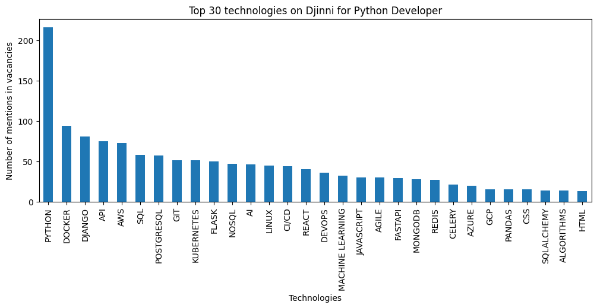

# Djinni Python Technologies Statistics

A web scraping and data analysis project that provides statistics on the 
most demanded technologies for Python developers based on Djinni job vacancies.

### Installation:

Python 3 must be installed

```shell
git clone https://github.com/arsenmakovei/djinni-technologies-statistics.git
cd djinni-technologies-statistics
python3 -m venv venv
source venv/bin/activate (on macOS)
venv\Scripts\activate (on Windows)
pip install -r requirements.txt
```

### Getting started:

Run scraper from directory, where is spiders directory

```shell
cd scraping
scrapy crawl vacancies -O vacancies.csv
```

Open `data_analysis/vacancies_analysis.ipynb` with Jupyter Notebook and run cells in order

You can also look at the finished results made on 10/05/2023 in folder `data_analysis/data_histograms/`

Here is one of them:


